# GitHub Actions Workflows per VitaLink

Questa directory contiene i workflow GitHub Actions per la CI/CD dell'applicazione VitaLink su AWS.

## 🚀 Workflow Disponibili

### 1. **aws-build-push.yml** - Build e Push su ECR
- **Trigger**: Push su `main` o `CLOUD_MOBILE_PROJECT`, PR, o manuale
- **Funzioni**:
  - Esegue i test dell'applicazione
  - Builda l'immagine Docker
  - Pusha l'immagine su Amazon ECR
  - Esegue scan di sicurezza
  - Triggera automaticamente il deployment

### 2. **aws-deploy.yml** - Deployment CloudFormation
- **Trigger**: Repository dispatch dal workflow di build, o manuale
- **Funzioni**:
  - Valida il template CloudFormation
  - Gestisce stack esistenti (update/delete)
  - Deploya l'infrastruttura AWS
  - Monitora il progresso del deployment
  - Esegue health check dell'applicazione

### 3. **aws-monitoring.yml** - Monitoraggio Infrastruttura
- **Trigger**: Schedulato ogni 4 ore, o manuale
- **Funzioni**:
  - Controlla lo stato degli stack CloudFormation
  - Monitora i servizi ECS
  - Verifica lo stato delle istanze RDS
  - Controlla i Load Balancer
  - Esegue health check dell'applicazione
  - Analizza i costi (quando disponibile)

### 4. **aws-cleanup.yml** - Pulizia Risorse
- **Trigger**: Solo manuale (con conferma)
- **Funzioni**:
  - Elimina stack CloudFormation
  - Rimuove risorse orfane
  - Pulisce repository ECR
  - Monitora il completamento della pulizia

### 5. **test-workflow-integration.yml** - Test di Integrazione
- **Trigger**: Solo manuale
- **Funzioni**:
  - Testa l'intera pipeline CI/CD
  - Valida la configurazione AWS
  - Esegue deployment di test
  - Verifica il funzionamento dell'applicazione
  - Pulisce le risorse di test

## 🔧 Configurazione Secrets

Per utilizzare questi workflow, configura i seguenti secrets nel repository GitHub:

```
AWS_ACCESS_KEY_ID      # AWS Access Key ID per AWS Education
AWS_SECRET_ACCESS_KEY  # AWS Secret Access Key
AWS_SESSION_TOKEN      # AWS Session Token (per AWS Education)
```

### Come ottenere le credenziali AWS Education:

1. Accedi ad AWS Academy/Learner Lab
2. Clicca su "AWS Details"
3. Copia le credenziali dalla sezione "AWS CLI"
4. Aggiungile come secrets in GitHub: Settings → Secrets and variables → Actions

## 🌊 Flusso CI/CD

```mermaid
graph TD
    A[Push to main] --> B[aws-build-push.yml]
    B --> C{Tests Pass?}
    C -->|Yes| D[Build Docker Image]
    C -->|No| E[❌ Stop]
    D --> F[Push to ECR]
    F --> G[Security Scan]
    G --> H[Trigger Deploy]
    H --> I[aws-deploy.yml]
    I --> J[Deploy CloudFormation]
    J --> K[Health Check]
    K --> L{Deploy Success?}
    L -->|Yes| M[✅ Complete]
    L -->|No| N[❌ Rollback]
```



## 📋 Utilizzo dei Workflow

### Deploy automatico:
1. Fai push su `main` → deployment automatico in staging
2. Per production: esegui manualmente il workflow `aws-deploy.yml`

### Deploy manuale:
1. Vai su Actions → "AWS CloudFormation Deploy"
2. Clicca "Run workflow"
3. Specifica l'URI dell'immagine e l'environment

### Monitoraggio:
- Il monitoraggio avviene automaticamente ogni 4 ore
- Per check immediato: esegui manualmente `aws-monitoring.yml`

### Pulizia:
1. Vai su Actions → "AWS Infrastructure Cleanup"
2. Scegli l'environment
3. Digita "DELETE" per confermare
4. Clicca "Run workflow"

## 🔍 Test della Pipeline:
1. Esegui `test-workflow-integration.yml`
2. Scegli il livello di test:
   - `basic`: Validazioni base
   - `full`: Test completo con deployment
   - `staging-deploy`: Deploy in ambiente di test

## ⚠️ Note Importanti

- **AWS Education**: I token di sessione scadono dopo alcune ore
- **Costi**: Monitora sempre i costi AWS dopo i deployment
- **Sicurezza**: Le password del database sono hardcoded per AWS Education
- **Backup**: Non c'è backup automatico dei dati in AWS Education

## 🆘 Troubleshooting

### Errore "Credenziali scadute":
- Aggiorna i secrets con nuove credenziali AWS Education

### Errore "Stack già esistente":
- Usa il workflow di cleanup per rimuovere stack esistenti

### Errore "Health check fallito":
- Controlla i log ECS nella console AWS
- Verifica che il database sia inizializzato

### Errore "Timeout deployment":
- AWS Education può essere più lento
- Riprova dopo alcuni minuti

## 📚 Risorse Aggiuntive

- [AWS CloudFormation Documentation](https://docs.aws.amazon.com/cloudformation/)
- [GitHub Actions Documentation](https://docs.github.com/en/actions)
- [AWS ECS Documentation](https://docs.aws.amazon.com/ecs/)
- [Docker Documentation](https://docs.docker.com/)
- `AWS_SECRET_ACCESS_KEY`: Your AWS secret access key  
- `AWS_SESSION_TOKEN`: Your AWS session token (for AWS Education accounts)

### Application Secrets
- `DATABASE_PASSWORD`: PostgreSQL database password (should match the one in your PowerShell script)
  - Example: `VitaLink2025!DB#Pass`

## Secret Configuration Instructions

### 1. AWS Credentials Setup

For AWS Education accounts, you need to update these credentials regularly (they expire every few hours):

```bash
# Get your current credentials from AWS Academy
aws sts get-caller-identity

# Copy the credentials from your AWS Academy session
```

### 2. GitHub Repository Setup

1. Go to your repository on GitHub
2. Navigate to Settings > Secrets and variables > Actions
3. Click "New repository secret" for each required secret
4. Add the secrets with the exact names listed above

### 3. Environment Protection (Optional)

For production deployments, consider setting up environment protection:

1. Go to Settings > Environments
2. Create a new environment called "production"
3. Add protection rules:
   - Required reviewers
   - Wait timer
   - Deployment branches

## Security Best Practices

### Credential Rotation
- AWS Education credentials expire frequently - set up notifications
- Rotate database passwords regularly
- Use GitHub's secret scanning to detect exposed secrets

### Access Control
- Use environment protection for production deployments
- Limit repository access to authorized team members
- Enable audit logging for secret access

### Monitoring
- Set up CloudWatch alarms for unusual AWS activity
- Monitor deployment logs for security events
- Use AWS CloudTrail for API call auditing

## Workflow Triggers

The workflows are configured with these triggers:

### Build and Push (`aws-build-push.yml`)
- **Trigger automatico**: Push su `main` o `CLOUD_MOBILE_PROJECT` branches
- **Trigger automatico**: Pull requests su `main`
- **Trigger manuale**: Via `workflow_dispatch`
- **Post-build**: Automaticamente triggera il CloudFormation deployment tramite `workflow_dispatch` e `repository_dispatch`

### CloudFormation Deploy (`aws-cloudformation-deploy.yml`)
- **Trigger automatico**: Dopo successful completion del workflow "AWS ECR Build and Push" (via `workflow_run`)
- **Trigger automatico**: Via `repository_dispatch` con event type `deploy-cloudformation`
- **Trigger manuale**: Con parametri per environment e image URI
- **Dipendenze**: Richiede artifact dal workflow di build (image URI) o parametri espliciti
- **Note**: Usa `dawidd6/action-download-artifact@v3` per scaricare artifact da workflow runs precedenti
- Automatic after successful build
- Manual trigger with parameters
- Environment-specific deployments

### Infrastructure Monitoring (`aws-monitoring.yml`)
- Scheduled runs (every 30 minutes during business hours)
- Manual trigger for detailed checks

### Cleanup (`aws-cleanup.yml`)
- Manual trigger only (requires "DELETE" confirmation)
- Optional ECR repository cleanup

## Troubleshooting

### Common Issues

1. **AWS Credentials Expired**
   - Update the AWS secrets in GitHub
   - Check AWS Academy for new session credentials

2. **CloudFormation Deploy not triggering after build**
   - Verify the build workflow completed successfully
   - Check that artifact upload succeeded in build workflow
   - Ensure branch matches trigger configuration (main or CLOUD_MOBILE_PROJECT)
   - The build workflow now attempts multiple trigger methods:
     - Primary: `workflow_dispatch` to CloudFormation workflow
     - Fallback: `repository_dispatch` with `deploy-cloudformation` event
   - Use "Test Workflow Integration" workflow to debug:
     - Choose `repository_dispatch` to test the fallback method
     - Choose `workflow_dispatch` to test the primary method
     - Choose `simulate_build` to test with artifacts
   - Check the debug job output in CloudFormation Deploy workflow

3. **CloudFormation Stack Errors**
   - Check the AWS CloudFormation console for detailed error messages
   - Review the stack events in the workflow logs

4. **ECS Task Failures**
   - Check ECS service logs in CloudWatch
   - Verify the Docker image build and push succeeded

5. **Database Connection Issues**
   - Ensure the database password secret matches the deployment
   - Check RDS instance status and security groups

### Getting Help

- Check workflow run logs in GitHub Actions tab
- Review AWS CloudFormation stack events
- Monitor AWS CloudWatch logs
- Use AWS CLI for manual debugging:
  ```bash
  aws cloudformation describe-stack-events --stack-name VitaLink-Stack
  aws ecs describe-services --cluster VitaLink-Cluster-production --services vitalink-service-production
  ```

## Cost Management

### Monitoring Costs
- Set up AWS billing alerts
- Use AWS Cost Explorer to track spending
- Monitor the scheduled runs of the monitoring workflow

### Cost Optimization
- Adjust ECS task count based on usage
- Use appropriate RDS instance sizes
- Clean up resources when not needed using the cleanup workflow

## Compliance Notes

### AWS Education Limitations
- Some AWS services may not be available
- Resource limits may apply
- Credentials have shorter expiration times

### Security Compliance
- All secrets are encrypted at rest in GitHub
- AWS credentials follow least-privilege principle
- Infrastructure follows AWS security best practices
